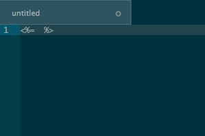

# erb-snippets

Snippets and tags hotkey useful for writing ERB.

## ERB tags:
`command`+`shift`+`,`

Supports multiple line/selection. Cycles through the tags.



Credits to [@eddorre](https://github.com/eddorre), I did the conversion from his
original SublimeText2 plugin.
https://github.com/eddorre/SublimeERB

## ERB snippets:

if+`tab`
```
<% if {condition} %>
  {true-block}
<% end %>
```

ife+`tab`
```
<% if {condition} %>
  {true-block}
<% else %>
  {false-block}
<% end %>
```

else+`tab`
```
<% else %>
```

elsif+`tab`
```
<% elsif {condition} %>
```

unless+`tab`
```
<% unless {condition} %>
  {false-block}
<% end %>
```

end+`tab`
```
<% end %>
```
